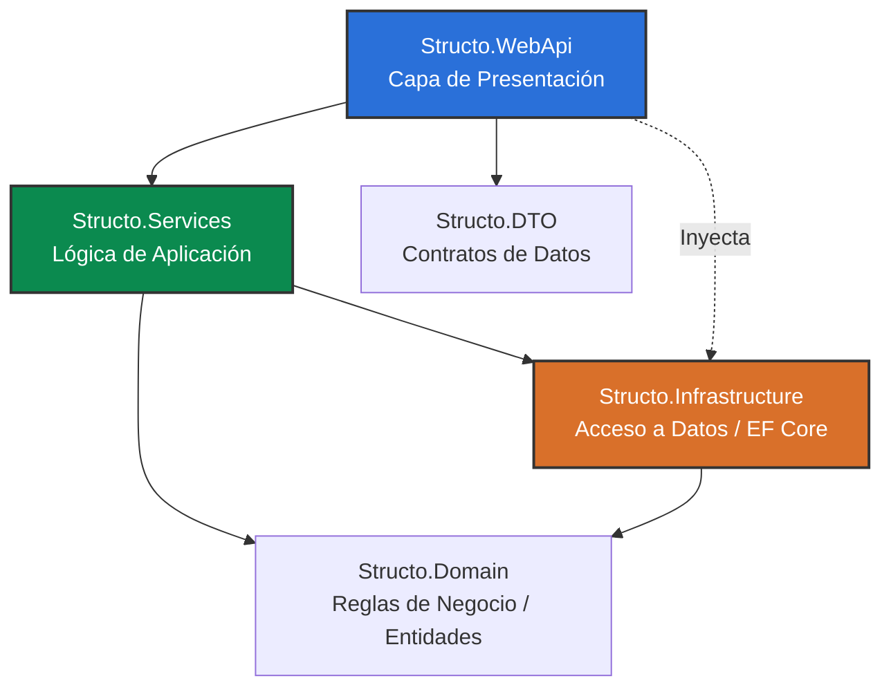

# Configuración y Arquitectura del Backend

El backend de **Structo** está desarrollado en **.NET 10** utilizando C#. Sigue los principios de la **Arquitectura Limpia (Clean Architecture)** y **N-Capas** para asegurar un código mantenible, testeable y desligado de las tecnologías externas.

## 🚀 Cómo levantar el entorno local

### 1. Preparación de Base de Datos
Asegúrate de tener corriendo tus bases de datos (SQL Server y MongoDB). Puedes levantar los contenedores usando el archivo `docker-compose.yml` (si dispones de él en la raíz o carpeta `docker/`):
```bash
docker-compose up -d
```
O usar tus instancias locales. Asegúrate de configurar las cadenas de conexión correctas en los archivos `appsettings.Development.json` dentro del proyecto principal.

### 2. Ejecutar Migraciones (Entity Framework)
Entra al proyecto backend. Puedes aplicar las migraciones a la base de datos SQL Server de dos maneras:
- **Opción 1: Usando los scripts (Recomendado)**
  ```bash
  ./ef.sh update
  ```
- **Opción 2: Usando `dotnet` tradicional**
  ```bash
  dotnet ef database update --project src/Structo.Infrastructure/Structo.Infrastructure.csproj --startup-project src/Structo.WebApi/Structo.WebApi.csproj
  ```

### 3. Cargar Datos Iniciales (Seed)
El proyecto backend está configurado para ejecutar el proceso de *Seeding* de datos de forma **automática** cada vez que se levanta la aplicación. Durante el arranque (`Program.cs`), si existen entidades base faltantes, el sistema las insertará por su cuenta usando `InitDatabase`.

Por lo tanto, simplemente arrancar la aplicación efectuará este proceso de *seeding*:
- **Opción 1: Usando el script `dev.sh` (Recomendado)**
  ```bash
  ./dev.sh run
  ```
- **Opción 2: Usando `dotnet` tradicional**
  ```bash
  dotnet run --project src/Structo.WebApi/Structo.WebApi.csproj
  ```

### 4. Correr el Proyecto
Al igual que las migraciones, tienes dos alternativas para levantar la Web API:
- **Opción 1: Usando los scripts (Recomendado)**
  ```bash
  ./dev.sh run
  ```
- **Opción 2: Usando `dotnet` tradicional**
  ```bash
  dotnet run --project src/Structo.WebApi/Structo.WebApi.csproj
  ```
El servidor de desarrollo iniciará y deberías poder acceder a la interfaz interactiva de la API (Swagger) navegando a:
- `http://localhost:5000/swagger` o
- `https://localhost:5001/swagger` (si usaste el comando de `dev.sh run` con perfil HTTPS activo).

---

## 🛠️ Listado de Comandos de Ayuda (Scripts Automáticos)
Para facilitar el flujo, el repositorio expone dos scripts `.sh` en la raíz del backend:

### Script `dev.sh`
Envuelve la interfaz de línea de comandos de .NET agregando la configuración por defecto y el perfil HTTPS.
- `./dev.sh run`: Ejecuta la aplicación con el perfil HTTPS.
- `./dev.sh watch`: Ejecuta la aplicación con Hot Reload (watch) habilitado.
- `./dev.sh build`: Compila la solución completa.
- `./dev.sh build-errors`: Compila mostrando únicamente los errores de compilación.
- `./dev.sh test`: Ejecuta todos los tests automáticos encontrados (Unidad e Integración).
- `./dev.sh clean`: Limpia la solución compilada.
- `./dev.sh restore`: Restaura todos los paquetes NuGet.

### Script `ef.sh`
Envuelve `dotnet ef` pre-estableciendo los nombres correctos de los proyectos de Infraestructura y WebApi.
- `./ef.sh add <nombre>`: Añade una nueva migración.
- `./ef.sh update`: Aplica las migraciones pendientes en la base de datos.
- `./ef.sh remove`: Revierte y elimina la última migración.
- `./ef.sh list`: Lista todas las migraciones existentes.

---

## 🏗️ Patrones de Diseño Utilizados

Durante el desarrollo del backend, se promueve el uso de los siguientes patrones arquitectónicos:

- **Inyección de Dependencias (DI)**: Utilizado orgánicamente en .NET Core para inyectar servicios en controladores y otros servicios, promoviendo el bajo acoplamiento.
- **Repository Pattern**: Abstracción de acceso a datos provista por las interfaces en el `Domain` y su implementación en la capa de `Infrastructure`.
- **Data Transfer Objects (DTO)**: Aislando completamente la capa de controladores y los modelos de dominio.
- **CQRS (Opcional, según complejidad)**: Separación ligera entre lectura y mutación manejada en la capa de servicios.

## 📁 Estructura de Proyectos (N-Capas)

La solución (`Structo.sln`) y el directorio `src/` están divididos conceptualmente:



### Descripción de las Capas

1. **Structo.WebApi**: Contiene los Controladores (Endpoints HTTP), la configuración del host y el registro de la inyección de dependencias (`Program.cs`). Responsable de recibir las consultas y delvolver DTOs.
2. **Structo.Services**: Contiene la lógica de aplicación. Coordina cómo la aplicación interactúa con la base de datos a través de las interfaces y aplica reglas de negocio a gran escala, orquestando mapeos entre Entidades de Dominio y DTOs.
3. **Structo.Domain**: Es el núcleo del sistema. Contiene las Entidades (modelos de tabla), Enums, Interfaces core y lógica de negocio pura de forma estricta. **No depende de ningún otro proyecto de la solución**.
4. **Structo.Infrastructure**: Contiene las clases de `DbContext` (Entity Framework), las implementaciones reales de los repositorios y la configuración hacia bases de datos externas (SQL Server / MongoDB). Depende de `Structo.Domain`.
5. **Structo.DTO**: Contiene estructuras planas que transportan los datos solicitados hacia el exterior de la API, evitando exponer directamente las clases del Dominio.
6. **Structo.Common**: Constantes transversales, excepciones personalizadas compartidas y métodos de extensión para toda la solución.

---

## 📐 Convenciones de Nombrado y DTOs

Al transportar datos, la aplicación obliga a separar la capa de Dominio de la capa HTTP usando **DTOs (Data Transfer Objects)**. Estos se ubican en `src/Structo.DTO/Models`. Para mantener la consistencia, usa los siguientes prefijos o sufijos:
- `*Model`: Para representar una entidad de salida o de vista general (ej. `OrderModel`).
- `Create*RequestModel` / `Create*Model`: Payload requerido para un endpoint `POST` (ej. `CreateOrderRequestModel`).
- `Update*RequestModel` / `Update*Model`: Payload para actualizar una entidad en un endpoint `PUT`.
- `*FilterModel` / `*Request`: Usado típicamente para recibir parámetros de búsqueda o paginación.

*Nota: La validación de los DTOs de entrada se realiza con `FluentValidation` en el directorio `Structo.DTO/FluentValidations/` antes de tocar los controladores.*

---

## 🔐 Autenticación y Autorización (Identity)

El sistema utiliza **ASP.NET Core Identity** con tokens **JWT** para manejar usuarios, roles y autenticación.
- **Roles:** El modelo de BD posee roles predefinidos (`SuperAdmin`, `Admin`, etc.).
- **Permisos Específicos (Claims):** Además de roles, el control fino se hace mediante `IdentityRoleClaim`. Por ejemplo, en el seed pudimos ver claims como `list:roles`, `edit:roles`. En los controladores, puedes usar la política/autorización basada en estos claims para restringir el acceso a ciertos endpoints.

---

## 🏗️ Flujo de Creación de una Nueva Entidad

Si necesitas agregar una tabla/funcionalidad completamente nueva al sistema (ej. `Invoice`), sigue esta secuencia estricta:
1. **Domain**: Crea la entidad `Invoice.cs` dentro de `src/Structo.Domain/Entities/`. Hereda de base entities si aplica.
2. **Infrastructure (DB)**: Agrega el `DbSet<Invoice> Invoices { get; set; }` en `AppDbContext.cs`.
3. **Migración**: Ejecuta `./ef.sh add AddInvoiceTable` seguido de `./ef.sh update` para actualizar la base de datos local.
4. **DTO y Validaciones**: Crea `InvoiceModel` y `CreateInvoiceModel` en `Structo.DTO`, y de ser necesario, un validador en `FluentValidations`.
5. **Services**: Crea `IInvoiceService` e `InvoiceService` en `Structo.Services/`. Aplica ahí tu lógica de negocio y registra el servicio en `ServicesInjection.cs`.
6. **WebApi**: Expone el controlador `InvoicesController.cs` inyectando el servicio.

---

## ⚙️ Tareas Background y Notificaciones

En `Program.cs` se inicializan herramientas clave para la comunicación asíncrona:
- **Quartz.NET**: Para tareas cronometradas (Scheduled Jobs). Si quieres que algo se corra todos los días a media noche, crea un Job de Quartz.
- **TickerQ**: Usado como una cola simple de tareas en memoria, principalmente para encolar trabajo transaccional/ligero y sacarlo del hilo HTTP principal.
- **SignalR (WebSockets)**: Configuraciones expuestas en los hubs `/hubs/tasks` o `/hubs/notifications` para empujar notificaciones en tiempo real al frontend Vue/Nuxt.
- **Notificaciones Externas**: La inyección de dependencias ya contempla clientes para Twilio (`ITwilioRestClient`) para WhatsApp/SMS y el ecosistema Facebook (`WhatsAppHttpClient`). Puedes inyectar estos servicios donde lo requieras.
