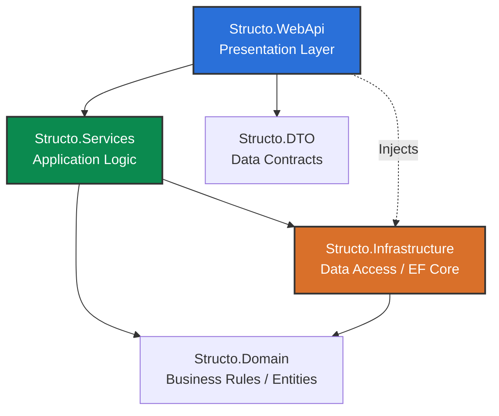

# Backend Setup and Architecture

The **Structo** backend is built on **.NET 10** using C#. It follows **Clean Architecture** and **N-Tier** principles to ensure the codebase remains maintainable, testable, and loosely coupled from external technologies.

## 🚀 How to Run Locally

### 1. Database Preparation
Ensure your databases (SQL Server and MongoDB) are running. You can bring up the containers using a `docker-compose.yml` file (if available in the root or `docker/` folder):
```bash
docker-compose up -d
```
Alternatively, use your local instances. Make sure to configure the correct connection strings in the `appsettings.Development.json` files within the main WebApi project.

### 2. Run Migrations (Entity Framework)
Enter the backend project and apply migrations to the SQL Server database:
```bash
dotnet ef database update --project src/Structo.Infrastructure/Structo.Infrastructure.csproj --startup-project src/Structo.WebApi/Structo.WebApi.csproj
```

### 3. Loading Initial Data (Seed)
To populate the database with base or testing data, the ecosystem usually provides a *Seeding* mechanism. This is often executed on application startup inside `Program.cs` configuration, or using a dedicated endpoint.

If the seed is configured via injection or an integrated endpoint, you typically just need to run the development project and/or trigger the dedicated endpoint (e.g., `POST /api/seed` from Swagger) to insert the first records.

### 4. Run the Project
Start the Web API by running the following command:
```bash
dotnet run --project src/Structo.WebApi/Structo.WebApi.csproj
```
The development server will initiate (typically exposing a Swagger UI at `http://localhost:<port>/swagger`).

---

## 🏗️ Applied Design Patterns

During the backend development, the following architectural patterns are actively promoted:

- **Dependency Injection (DI)**: Natively used within .NET Core to inject services into controllers and other layers, promoting low coupling.
- **Repository Pattern**: Data access abstraction provided by interfaces inside the `Domain` and physically implemented in the `Infrastructure` layer.
- **Data Transfer Objects (DTO)**: Completely isolating the controller responses from mapping directly to domain models.
- **CQRS (Optional, based on complexity)**: Lightweight separation between reads and mutations handled gracefully in the services layer.

## 📁 Project Structure (N-Tier)

The solution (`Structo.sln`) and the `src/` directory are conceptually split into class libraries:



### Layer Descriptions

1. **Structo.WebApi**: Contains Controllers (HTTP Endpoints), host configuration, and the dependency injection registry (`Program.cs`). Responsible for handling requests and returning DTOs.
2. **Structo.Services**: Contains application logic. Coordinates interactions with the database via interfaces, and applies business orchestration mapping Domain Entities to/from DTOs.
3. **Structo.Domain**: The core of the system. Contains Entities (table models), Enums, core Interfaces, and pure business logic strictness. **It has zero references to any other project in the solution**.
4. **Structo.Infrastructure**: Contains `DbContext` classes (Entity Framework), concrete repository implementations, and setups for external databases (SQL Server / MongoDB). Depends on `Structo.Domain`.
5. **Structo.DTO**: Contains flat structures that transport the requested data to the boundaries of the API, avoiding directly exposing Domain classes.
6. **Structo.Common**: Cross-cutting constants, shared custom exceptions, and extension methods utilized across the whole platform.
