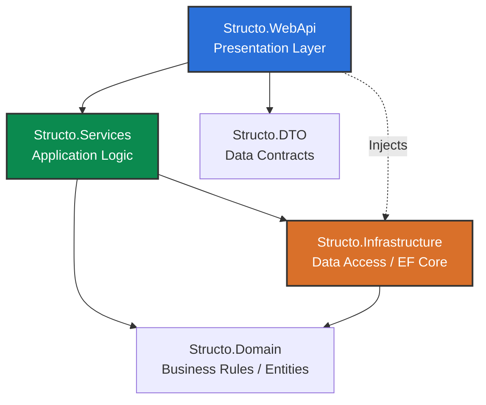

# Backend Setup and Architecture

The **Structo** backend is built on **.NET 10** using C#. It follows **Clean Architecture** and **N-Tier** principles to ensure the codebase remains maintainable, testable, and loosely coupled from external technologies.

## 🚀 How to Run Locally

### 1. Database Preparation
Ensure your databases (SQL Server and MongoDB) are running. You can bring up the containers using a `docker-compose.yml` file (if available in the root or `docker/` folder):
```bash
docker-compose up -d
```
Alternatively, use your local instances. Make sure to configure the correct connection strings in the `appsettings.Development.json` files within the main WebApi project.

### 2. Run Migrations (Entity Framework)
Enter the backend project. You can apply migrations to the SQL Server database in two ways:
- **Option 1: Using automated scripts (Recommended)**
  ```bash
  ./ef.sh update
  ```
- **Option 2: Using standard `dotnet` CLI**
  ```bash
  dotnet ef database update --project src/Structo.Infrastructure/Structo.Infrastructure.csproj --startup-project src/Structo.WebApi/Structo.WebApi.csproj
  ```

### 3. Loading Initial Data (Seed)
The backend project is configured to run the *Seeding* process **automatically** every time the application starts. During startup (`Program.cs`), if foundational entities are missing, the system will auto-insert them using `InitDatabase`.

### 4. Run the Project
Similar to migrations, you have two alternatives for running the Web API:
- **Option 1: Using automated scripts (Recommended)**
  ```bash
  ./dev.sh run
  ```
- **Option 2: Using standard `dotnet` CLI**
  ```bash
  dotnet run --project src/Structo.WebApi/Structo.WebApi.csproj
  ```
The development server will initiate and you should be able to access the interactive API interface (Swagger) by navigating to:
- `http://localhost:5000/swagger` or
- `https://localhost:5001/swagger` (if you used the `dev.sh run` command with the active HTTPS profile).

---

## 🛠️ Helper Commands List (Automated Scripts)
To streamline the workflow, the repository provides two `.sh` scripts at the root of the backend directory:

### Script `dev.sh`
Wraps the .NET CLI by appending the default configurations and the HTTPS launch profile.
- `./dev.sh run`: Runs the application with the HTTPS profile.
- `./dev.sh watch`: Runs the application with Hot Reload (watch) enabled.
- `./dev.sh build`: Builds the entire solution.
- `./dev.sh build-errors`: Builds the solution but outputs only compilation errors.
- `./dev.sh test`: Runs all automatic tests found (Unit and Integration).
- `./dev.sh clean`: Cleans the compiled solution.
- `./dev.sh restore`: Restores all NuGet packages.

### Script `ef.sh`
Wraps `dotnet ef` by pre-setting the correct paths to the Infrastructure and WebApi projects.
- `./ef.sh add <name>`: Adds a new migration.
- `./ef.sh update`: Applies pending migrations to the database.
- `./ef.sh remove`: Reverts and deletes the last migration.
- `./ef.sh list`: Lists all existing migrations.

---

## 🏗️ Applied Design Patterns

During the backend development, the following architectural patterns are actively promoted:

- **Dependency Injection (DI)**: Natively used within .NET Core to inject services into controllers and other layers, promoting low coupling.
- **Repository Pattern**: Data access abstraction provided by interfaces inside the `Domain` and physically implemented in the `Infrastructure` layer.
- **Data Transfer Objects (DTO)**: Completely isolating the controller responses from mapping directly to domain models.
- **CQRS (Optional, based on complexity)**: Lightweight separation between reads and mutations handled gracefully in the services layer.

## 📁 Project Structure (N-Tier)

The solution (`Structo.sln`) and the `src/` directory are conceptually split into class libraries:



### Layer Descriptions

1. **Structo.WebApi**: Contains Controllers (HTTP Endpoints), host configuration, and the dependency injection registry (`Program.cs`). Responsible for handling requests and returning DTOs.
2. **Structo.Services**: Contains application logic. Coordinates interactions with the database via interfaces, and applies business orchestration mapping Domain Entities to/from DTOs.
3. **Structo.Domain**: The core of the system. Contains Entities (table models), Enums, core Interfaces, and pure business logic strictness. **It has zero references to any other project in the solution**.
4. **Structo.Infrastructure**: Contains `DbContext` classes (Entity Framework), concrete repository implementations, and setups for external databases (SQL Server / MongoDB). Depends on `Structo.Domain`.
5. **Structo.DTO**: Contains flat structures that transport the requested data to the boundaries of the API, avoiding directly exposing Domain classes.
6. **Structo.Common**: Cross-cutting constants, shared custom exceptions, and extension methods utilized across the whole platform.
