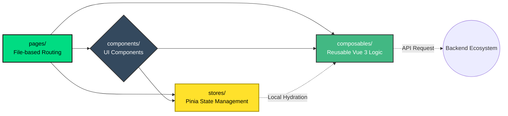

# Frontend Setup and Architecture

The **Structo** frontend is built using **Nuxt 4**, which runs on top of **Vue 3**. Nuxt provides a robust architecture by default, supporting Server-Side Rendering (SSR) or Static Site Generation (SSG) while naturally structuring the codebase.

## 🚀 How to Run Locally

### 1. Install Dependencies
Make sure you have Node.js (22 or higher) installed. Open your terminal, navigate to the frontend project, and install all dependencies:
```bash
npm install
```

### 2. Environment Variables
Ensure you have configured the correct environments by reviewing or adjusting the respective file for local development. Nuxt 4 natively reads variables from `.env`.

### 3. Start the Development Server
To run the application with Hot Module Replacement (HMR):
```bash
npm run dev
```
The web application will typically be served at `http://localhost:3000`.

---

## 🏗️ Applied Patterns and Ecosystem

- **Strict Typescript**: All core code, `stores`, and requests are strongly typed (TypeScript) to prevent runtime errors.
- **Vuetify (UI Library)**: **Vuetify** is heavily utilized as the main visual component framework (Material Design), providing a complete ecosystem of adaptive buttons, tables, grids, and directives.
- **Pinia for State Management**: Replaces Vuex. Used in the `stores/` folder to manage transparent and reactive global data flows throughout the application.
- **Composables**: Extensive use of the Vue 3 Composition API (`setup()`). Composables allow you to extract reusable logic and state into pages or components.
- **Shared Auto-imports**: Nuxt 4 auto-imports components, composables, and utilities by default, saving you from having to clutter the explicit imports section.

## 📁 Directory Structure

The structure under the `frontend/app` folder follows Nuxt's conventional File-System Routing standard:



### App Main Directories Description

- **app.vue**: The main component and visual entry point of the application.
- **pages/**: Hosts the _View_ components. Each `.vue` file within this directory graphically represents a different web route.
- **components/**: Used for modular and reusable visual components. Nuxt will register them automatically around the project.
- **layouts/**: Allows setting common graphical shells (navbar, footer, sidebar, etc.) to be shared between different `pages`.
- **composables/**: Hosts exported functions (like `useMyLogic()`). Ideal for direct fetch requests, logical state, and form utilities.
- **stores/**: Defines the **Pinia** stores. Centralized data logic (e.g., the current user session, active cart, etc.).
- **middleware/**: Code that executes _before_ transitioning to a particular route. (Ideal for authentication guards).
- **plugins/**: Global code that loads to initialize extra tools inside the Vue instance before rendering.
- **public/** and **assets/**: For static images, web fonts, or global stylesheets (like CSS/SCSS).

---

## 🌐 HTTP Fetch Flow

To communicate with the backend API, the application avoids native `fetch` or raw `axios` scattered throughout the code. Instead, it relies on Nuxt/Vue 3 composables (like a custom `$fetch` or `useFetch`).
- **`apiFetch` / Custom Fetch:** Typically, these wrappers automatically intercept requests to attach the **JWT Token** from the active session into the headers (`Authorization: Bearer <token>`).
- **Usage:** Call these fetch methods ideally inside your Pinia actions (stores) or directly within the `<script setup>` block of your components and composables.

---

## 🔐 Authentication & Accounts (Session)

The frontend integrates **`@sidebase/nuxt-auth`** to handle the entire session lifecycle securely.
- **Login and Logout:** Use functions like `signIn()` and `signOut()` provided by the module. They negotiate token exchange with the backend and handle local storage.
- **Protected Routes:** Nuxt `middleware` (e.g., `definePageMeta({ middleware: 'auth' })`) is applied inside individual `pages/` to block unauthenticated access, forcing redirects back to the login screen.
- **User State:** The connected user's payload (Claims, Roles) is globally accessible by using `useAuth()` or through a dedicated Pinia Session Store.

---

## 🌍 Internationalization (i18n)

Multilingual support is achieved using the **`@nuxtjs/i18n`** Nuxt module.
- **Dictionaries:** Translation mappings are defined either in configuration or through external files (e.g., `en.json`, `es.json`) usually kept in a `locales/` or similar directory.
- **Usage inside Components:** To output translated text, use the `$t('translation.key')` function in your Vue templates, or call the `useI18n()` composable within your scripts.
- **Switching Locales:** Exposes functions (like `setLocale('en')`) to actively toggle the platform's language on the fly.

---

## 📝 Environment Variables and Configuration

The application spins up using variables defined in `.env` files located in the frontend root (such as `.env.local`, `.env.staging`, `.env.production`). Critical keys usually include:
- **`NUXT_PUBLIC_API_BASE`** (or similar): Defines the absolute URL pointing to the backend (e.g., `http://localhost:5000/api`).
Remember to review or scaffold your own `.env.local` file before running the project initially via `npm run dev`.
