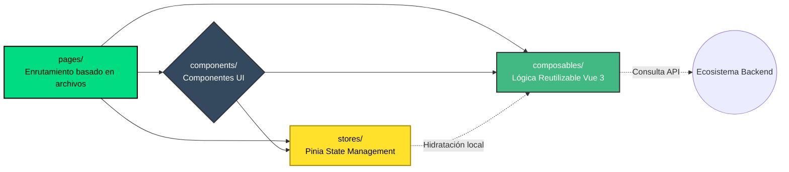

# Configuración y Arquitectura del Frontend

El frontend de **Structo** está desarrollado usando **Nuxt 4** que funciona sobre **Vue 3**. Nuxt proporciona una arquitectura robusta por defecto, soportando renderizado del lado del servidor (SSR) o generación de sitios estáticos (SSG) además de estructurar naturalmente la base del código.

## 🚀 Cómo levantar el entorno local

### 1. Instalar las dependencias
Asegúrate de tener instalado Node.js (22 o superior). Abre la consola, dirígete al proyecto frontend e instala todas las dependencias:
```bash
npm install
```

### 2. Variables de Entorno
Asegúrate de configurar los entornos correctos revisando o ajustando el archivo respectivo para local. Nuxt 4 lee nativamente variables de `.env`.

### 3. Levantar el Servidor de Desarrollo
Para correr la aplicación con _Hot Module Replacement_ (HMR):
```bash
npm run dev
```
La aplicación web típicamente se servirá en `http://localhost:3000`.

---

## 🏗️ Patrones y Ecosistema Utilizado

- **Typescript Estricto**: Todo el código principal, estados (`stores`) y peticiones se tipan fuertemente (TypeScript) para evitar errores en tiempo de ejecución.
- **Vuetify (Librería UI)**: Se utiliza **Vuetify** como marco principal de componentes visuales (Material Design), proporcionando un completo ecosistema de botones, tablas, grids y directivas adaptables.
- **Pinia para Manejo de Estado**: Reemplaza a Vuex. Utilizado en la carpeta `stores/` para manejar flujos de datos globales transparentes y reactivos en toda la aplicación.
- **Composables**: Extensa utilización de la API de Composición de Vue 3 (`setup()`). Los composables permiten extraer estado y lógica reutilizable a las páginas o componentes.
- **Auto-importado Compartido**: Nuxt 4 auto-importa por defecto los componentes, composables y utilidades, evitando tener que llenarlo todo en la sección de imports explícitos.

## 📁 Estructura de Directorios

La estructura bajo la carpeta `frontend/app` respeta el estándar convencional de enrutamiento basado en archivos (File-System Routing) de Nuxt:



### Descripción de los Directorios Principales (App)

- **app.vue**: El componente principal y punto de entrada visual de la aplicación.
- **pages/**: Aloja los componentes _View_. Cada archivo `.vue` dentro de este directorio representa gráficamente una ruta web distinta.
- **components/**: Utilizado para componentes visuales modulares y reutilizables. Nuxt los registrará automáticamente alrededor del proyecto.
- **layouts/**: Permite establecer cascarones gráficos comunes (navbar, footer, sidebar, etc.) para compartir entre diferentes `pages`.
- **composables/**: Aloja funciones exportadas (al estilo `useMiLogica()`). Ideales para peticiones fetch directas, estado lógico y utilidades de formularios.
- **stores/**: Define los almacenes de **Pinia**. Lógica centralizada de datos (por ejemplo la sesión actual del usuario, el carrito activo, etc.).
- **middleware/**: Código que se ejecuta _antes_ de transicionar a una ruta particular. (Ideal para guardias de autenticación).
- **plugins/**: Código que carga globalmente para inicializar herramientas extras dentro de la instancia de Vue antes del render.
- **public/** y **assets/**: Para imágenes estáticas, fuentes web o hojas de estilo globales (como CSS/SCSS).
